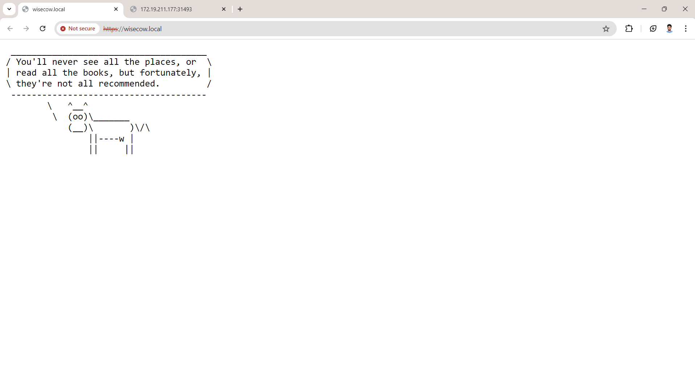
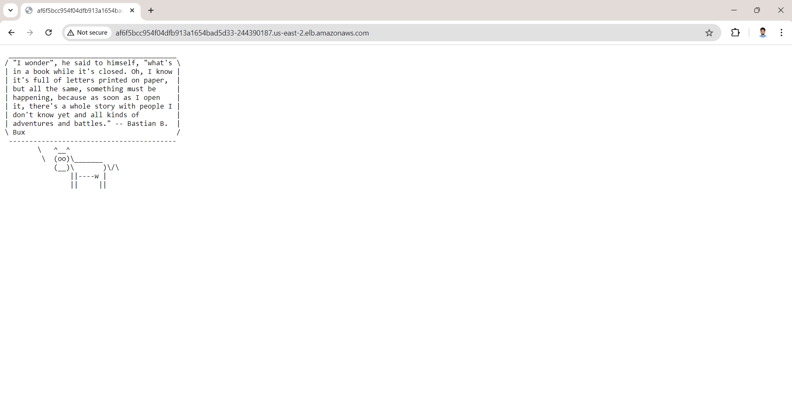

# Wisecow Application Local Deployment on Kubernetes with Minikube

## Overview

This guide details the steps to locally deploy the Wisecow application on Kubernetes using Minikube. It covers setting up the environment, building and running Docker containers, configuring TLS, and ensuring everything works correctly with Minikube.

## Prerequisites

1. **Minikube**: Ensure Minikube is installed and running.
2. **Docker**: Install Docker on your local machine.
3. **kubectl**: Install `kubectl` for Kubernetes management.
4. **Git**: Install Git for cloning repositories.

## 

## Setup Instructions

1. Clone the Repository

Start by cloning the Wisecow repository:

```bash
git clone https://github.com/gadagojushiva/wisecow
cd wisecow
```
2. Update Kubernetes Service Configuration.
Modify the service.yaml file to change the service type from LoadBalancer to NodePort
```yaml
apiVersion: v1
kind: Service
metadata:
  name: wisecow-service
spec:
  selector:
    app: wisecow
  ports:
    - protocol: TCP
      port: 80
      targetPort: 4499
  type: NodePort
```
3. Build and Run Docker Container.
Build the Docker image and run it locally:

```bash
docker build -t wisecow .
docker run -d -p 4499:4499 wisecow
```
You can now access the application at http://localhost:4499.

4. Configure TLS.
Create a TLS certificate and apply it to the Kubernetes cluster:
```bash
mkdir certs
cd certs
"C:\Program Files\Git\usr\bin\openssl.exe" req -x509 -nodes -days 365 -newkey rsa:2048 -keyout tls.key -out tls.crt -subj "/CN=wisecow.local/O=wisecow"
kubectl create secret tls wisecow-tls --key tls.key --cert tls.crt
```
5. Apply Kubernetes Manifests.
Deploy the application to Minikube:

```bash
kubectl apply -f deployment.yaml
kubectl apply -f service.yaml
kubectl apply -f ingress.yaml
```
6. Update Hosts File.
Update your /etc/hosts file to map Minikube's IP address to the domain:

Get the Minikube IP:


```bash
minikube ip

# Update /etc/hosts:
sudo nano /etc/hosts

# Add the following line:
<Minikube-IP> wisecow.local
```

7. Access the Application.
Open a browser and visit https://wisecow.local. You should see the Wisecow application running with TLS.

-------------------------------------------------------------------------------------------------------------------------------------------------------------------
# Wisecow Application Deployment On EKS

## Overview

This project involves deploying the Wisecow application to a Kubernetes environment using AWS EKS (Elastic Kubernetes Service). The process includes containerizing the application, setting up a Kubernetes cluster, and automating the deployment using GitHub Actions.

## Prerequisites

Before you begin, ensure you have the following prerequisites:

1. **AWS Account**: You need an AWS account to create and manage resources.
2. **AWS Access Key and Secret Key**: Obtain these credentials from your AWS IAM user.
3. **AWS CLI**: Install the AWS CLI on your local machine to interact with AWS services.

### Snapshots Of Wisecow Application Running of kubernetes(AWS EKS)


## Setup Instructions

### 1. Configure AWS Credentials in GitHub

1. **Generate AWS Access Key and Secret Key**:
   - Log in to the AWS Management Console.
   - Go to the IAM (Identity and Access Management) service.
   - Create a new IAM user or use an existing user with appropriate permissions.
   - Generate and download the AWS Access Key ID and Secret Access Key.

2. **Add AWS Credentials to GitHub Secrets**:
   - Go to your GitHub repository settings.
   - Navigate to "Secrets and variables" > "Actions".
   - Add the following secrets:
     - `AWS_ACCESS_KEY_ID`
     - `AWS_SECRET_ACCESS_KEY`
     - `AWS_REGION` (e.g., `us-east-2`)
     - `K8S_CLUSTER_NAME` (e.g., `wisecow`)

### 2. Create and Configure AWS EKS Cluster

1. **Create an EKS Cluster**:
   - Log in to the AWS Management Console.
   - Navigate to the EKS service and create a new EKS cluster.
   - Follow the wizard to set up your cluster.

2. **Create a Node Group**:
   - After creating the cluster, set up a node group to manage the worker nodes.
   - Ensure that the node group is associated with the created EKS cluster.

3. **Note the Cluster Name**:
   - Take note of your EKS cluster name as you'll need it later.

### 3. Configure GitHub Actions Workflow

1. **Clone the Repository**:
   - Clone the Wisecow repository to your local machine.
   - Navigate to the `.github/workflows` directory in the repository.

2. **Update Deployment Configuration**:
   - Open the `deploy.yaml` file in the `.github/workflows` directory.
   - Update the `cluster name` in the file to match your EKS cluster name.
   - Ensure that the AWS credentials and Docker credentials are configured in GitHub secrets as mentioned earlier.


### 4. Trigger GitHub Actions

1. **Push Changes to GitHub**:
   - Make any necessary changes to the `wisecow.sh` script to trigger the GitHub Actions workflow.
   - This will trigger the GitHub Actions workflow to build the Docker image, push it to DOcker Hub, and deploy the application to EKS.

## Workflow Overview

- **Build Docker Image**: The workflow builds a Docker image from the Dockerfile.
- **Push Docker Image to DockerHub**: The image is pushed to the DockerHub registry
- **Deploy to Kubernetes**: The application is deployed to the AWS EKS cluster using `kubectl`.


## Troubleshooting

- **Authentication Issues**: Ensure that the AWS credentials and Kubernetes configuration are correct.
- **Deployment Errors**: Check the GitHub Actions logs for details on any errors during the build or deployment process.
